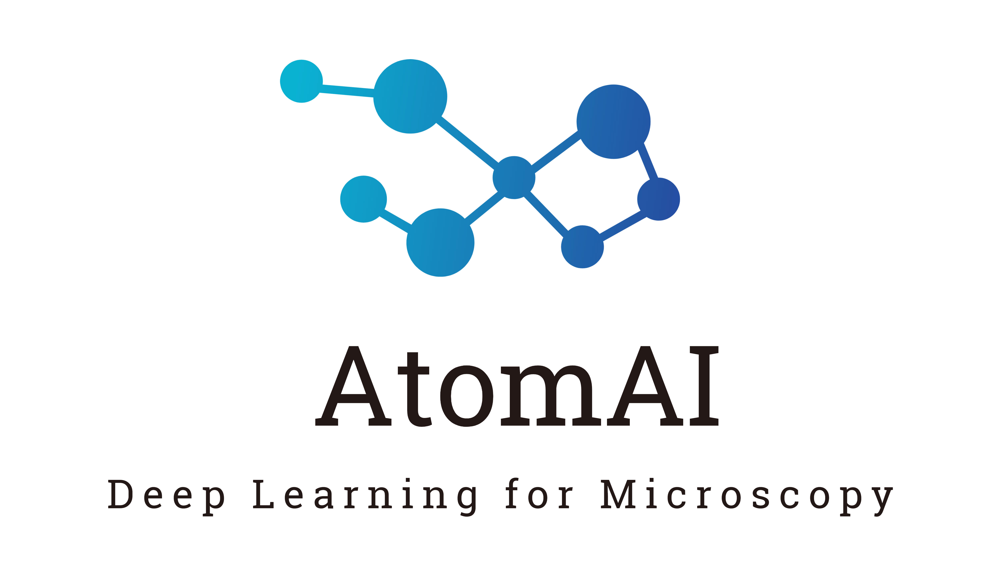

[](https://badge.fury.io/py/atomai)
[](https://github.com/pycroscopy/atomai/actions/workflows/actions.yml)
[](https://codecov.io/gh/pycroscopy/atomai)
[](https://atomai.readthedocs.io/en/stable/?badge=stable)

[](https://pepy.tech/project/atomai)
[](https://colab.research.google.com/github/pycroscopy/atomai/blob/master/examples/notebooks/Quickstart_AtomAI_in_the_Cloud.ipynb)
[](https://gitpod.io/#https://github.com/pycroscopy/atomai)

# AtomAI

## What is AtomAI

AtomAI is a Pytorch-based package for deep and machine learning analysis of microscopy data that doesn't require any advanced knowledge of Python or machine learning. The intended audience is domain scientists with a basic understanding of how to use NumPy and Matplotlib. It was developed by Maxim Ziatdinov at Oak Ridge National Lab.


<p align="center">
  
<p align="justify">

## Why AtomAI

The purpose of the AtomAI is to provide an environment that bridges the instrument specific libraries and general physical analysis by enabling the seamless deployment of machine learning algorithms including deep convolutional neural networks, invariant variational autoencoders, and decomposition/unmixing techniques for image and hyperspectral data analysis. Ultimately, it aims to combine the power and flexibility of the PyTorch deep learning framework and simplicity and intuitive nature of packages such as scikit-learn, with a focus on scientific data.  

#### Scientific papers that used AtomAI:

- Exploring causal physical mechanisms via non-Gaussian linear models and deep kernel learning: applications for ferroelectric domain structures. *ACS Nano* 16, 1250-1259 (2022). DOI: 10.1021/acsnano.1c09059
- Exploring order parameters and dynamic processes in disordered systems via variational autoencoders. *Science Advances* 7, eabd5084 (2021). DOI: 10.1126/sciadv.abd5084
- Tracking atomic structure evolution during directed electron beam induced Si-atom motion in graphene via deep machine learning. *Nanotechnology* 32, 035703 (2020). DOI: 10.1088/1361-6528/abb8a6

  [**Show full list**](https://atomai.readthedocs.io/en/latest/papers.html)


## Chat with us about DL/ML in Microscopy (beta)

Have some specific questions about applications of deep/machine learning (DL/ML) in microscopy? Feel free to ask them on Gitter! [](https://gitter.im/pycroscopy/AtomAI?utm_source=badge&utm_medium=badge&utm_campaign=pr-badge)

## How to use AtomAI

### Quickstart: AtomAI in the Cloud

The easiest way to start using AtomAI is via [Google Colab](https://colab.research.google.com/notebooks/intro.ipynb): 

- [Train a Deep Fully Convolutional Neural Network for Atom Finding](https://colab.research.google.com/github/pycroscopy/atomai/blob/master/examples/notebooks/AtomicSemanticSegmention.ipynb)

- [Im2Spec: Predict 1D Spectra from 2D Images](https://colab.research.google.com/github/pycroscopy/atomai/blob/master/examples/notebooks/ImSpec.ipynb) 

- [Defect sniffer: Deep Learning and Graph Analysis to Locate Specific Types of Defects](https://colab.research.google.com/github/pycroscopy/atomai/blob/master/examples/notebooks/GraphAnalysis.ipynb)

- [Variational Autoencoders: Exploring Order Parameters in Disordered Systems from Atomic Movies](https://colab.research.google.com/github/pycroscopy/atomai/blob/master/examples/notebooks/rVAE_graphene.ipynb)

- [Implementation of Custom Image Denoiser in AtomAI](https://colab.research.google.com/github/pycroscopy/atomai/blob/master/examples/notebooks/atomai_custom_model.ipynb)
   
  [*More examples ->*](https://atomai.readthedocs.io/en/latest/examples.html)


### Semantic segmentation

If your goal is to train and/or apply deep learning models for semantic segmentation of your experimental images, it is recommended to start with ```atomai.models.Segmentor```, which provides an easy way to train neural networks (with just two lines of code) and to make a prediction with trained models (with just one line of code). Here is an example of how one can train a neural network for atom/particle/defect finding with essentially two lines of code:
```python
import atomai as aoi
# Initialize model
model = aoi.models.Segmentor(nb_classes=3)  # uses UNet by default
# Train
model.fit(images, labels, images_test, labels_test, # training data (numpy arrays)
          training_cycles=300, compute_accuracy=True, swa=True # training parameters
) 
```
Here ```swa``` stands for [stochastic weight averaging](https://arxiv.org/abs/1803.05407), which usually allows improving the model's accuracy and leads to better generalization. The trained model can be used to find atoms/particles/defects in new, previously unseen (by a model) data:
```python
nn_output, coordinates = model.predict(expdata)
```

### ImSpec models
AtomAI also provides models that can be used for predicting spectra from image data and vice versa. These models can be used for predicting property (functionality) from structure. An example can be predicting approximate scanning tulleling spectroscopy or electron energy loss spectroscopy spectra from structural images of local sample regions (the assumption is of course that there is only a small variability of spectral behaviour within each  (sub)-image). The training/prediction routines are very similar to those of the semantic segmentation model, with the main difference being that one has to specify the dimensions of input and output
data:
```python
in_dim = (16, 16)  # Input dimensions (image height and width)
out_dim = (64,)  # Output dimensions (spectra length)

# Initialize and train model
model = aoi.models.ImSpec(in_dim, out_dim, latent_dim=10)
model.fit(imgs_train, spectra_train, imgs_test, spectra_test,  # training data (numpy arrays)
       full_epoch=True, training_cycles=120, swa=True  # training parameters
)
```
Make a prediction with the trained ImSpec model by running
```python
prediction = model.predict(imgs_val, norm=False)
```

### Deep ensembles

One can also use AtomAI to train an ensemble of models instead of just a single model. The average ensemble prediction is usually more accurate and reliable than that of the single model. In addition, we also get the information about the [uncertainty in our prediction](https://arxiv.org/abs/1612.01474) for each pixel/point.

```python
# Ititialize and compile ensemble trainer
etrainer = aoi.trainers.EnsembleTrainer("Unet", nb_classes=3)
etrainer.compile_ensemble_trainer(training_cycles=500, compute_accuracy=True, swa=True)

# Train ensemble of 10 models starting every time with new randomly initialized weights
smodel, ensemble = etrainer.train_ensemble_from_scratch(
    images, labels, images_test, labels_test, n_models=10)
```
The ensemble of models can be then used to make a prediction with uncertainty estimates for each point (e.g. each pixel in the image):

```python
predictor = aoi.predictors.EnsemblePredictor(smodel, ensemble, nb_classes=3)
nn_out_mean, nn_out_var = predictor.predict(expdata)
```

### Variational autoencoders (VAE)

AtomAI has built-in [variational autoencoders (VAEs)](https://arxiv.org/abs/1906.02691) for finding in the unsupervised fashion the most effective reduced representation of system's local descriptors. The available VAEs are regular VAE, rotationally and/or translationally invariant VAE (rVAE), class-conditined VAE/rVAE, and joint VAE/rVAE. The VAEs can be applied to both raw data and NN output, but typically work better with the latter. Here's a simple example:
```python
# Get a stack of subimages from experimental data (e.g. a semantically segmented atomic movie)
imstack, com, frames = aoi.utils.extract_subimages(nn_output, coords, window_size=32)

# Intitialize rVAE model
input_dim = (32, 32)
rvae = aoi.models.rVAE(input_dim, latent_dim=2) 

# Train
rvae.fit(
    imstack_train, 
    rotation_prior=np.pi/3, training_cycles=100,
    batch_size=100)
    
# Visualize the learned manifold
rvae.manifold2d();
```
One can also use the trained VAE to view the data distribution in the latent space. In this example the first 3 latent variables are associated with rotations and xy-translations (they are automatically added in rVAE to whatever number of latent dimensions is specified), whereas the last 2 latent variables are associated with images content.
```python
encoded_mean, encoded_sd = rvae.encode(imstack)
z1, z2, z3 = encoded_mean[:,0], encoded_mean[:, 1:3], encoded_mean[:, 3:]
```

### Deep kernel learning
AtomAI has an easy-to-use deep kernel learning module for performing automated experiments. The DKL, originally [introduced](https://arxiv.org/abs/1511.02222) by Andrew Gordon Wilson, can be understood as a hybrid of classical deep neural network (DNN) and Gaussian process (GP). The DNN serves as a feature extractor that allows reducing the complex high-dimensional features to low-dimensional descriptors on which a standard GP kernel operates. The parameters of DNN and of GP kernel are optimized jointly by performing a gradient ascent on marginal log-likelihood. Practically, the DKL training inputs are a small number of patches from an easy-to-acquire structural image (e.g., topography in STM), and training targets are usually a physical property (e.g. size of superconducting gap) derived from the spectra measured in those patches. The DKL output on the new inputs (image patches for which there are no measured spectra) is the expected property value and associated uncertainty, which are used to derive the next measurement point.
```python
exploration_steps = 50
data_dim = X_measured.shape[-1]  # here the image height and width are 'flattened'
for e in range(exploration_steps):
    # obtain/update DKL posterior
    dklgp = aoi.models.dklGPR(data_dim, embedim=2, precision="single")
    dklgp.fit(X_measured, y_measured, training_cycles=200)
    # Thompson sampling for getting the next measurement point
    obj, next_point_idx = dklgp.thompson(X_unmeasured)
    # Select the next point to measure (assumes a discrete grid of points)
    next_point = indices_unmeasured[next_point_idx]
    # Do measurement and update sets measured/unmeasured points
    ...
```

### Custom models

Finally, it is possible to use AtomAI trainers and predictors for easy work with custom PyTorch models. Suppose we define a custom denoising autoencoder in Pytorch as
```python
import torch
from atomai.nets import ConvBlock, UpsampleBlock 

torch_encoder = torch.nn.Sequential(
    ConvBlock(ndim=2, nb_layers=1, input_channels=1, output_channels=8, batch_norm=False),
    torch.nn.MaxPool2d(2, 2),
    ConvBlock(2, 2, 8, 16, batch_norm=False),
    torch.nn.MaxPool2d(2, 2),
    ConvBlock(2, 2, 16, 32, batch_norm=False),
    torch.nn.MaxPool2d(2, 2),
    ConvBlock(2, 2, 32, 64, batch_norm=False)
)
torch_decoder = torch.nn.Sequential(
    UpsampleBlock(ndim=2, input_channels=64, output_channels=64, mode="nearest"),
    ConvBlock(2, 2, 64, 32, batch_norm=False),
    UpsampleBlock(2, 32, 32, mode="nearest"),
    ConvBlock(2, 2, 32, 16, batch_norm=False),
    UpsampleBlock(2, 16, 16, mode="nearest"),
    ConvBlock(2, 1, 16, 8, batch_norm=False),
    torch.nn.Conv2d(8, 1, 1)
)
torch_DAE = torch.nn.Sequential(torch_encoder, torch_decoder)
```
We can easily train this model using AtomAI's trainers:
```python
# Initialize trainer and pass our model to it
trainer = aoi.trainers.BaseTrainer()
trainer.set_model(torch_DAE)

# Fix the initialization parameters (for reproducibility)
aoi.utils.set_train_rng(1)
trainer._reset_weights()
trainer._reset_training_history()
# Compile trainer
trainer.compile_trainer(
    (imgdata_noisy, imgdata, imgdata_noisy_test, imgdata_test), # training data
    loss="mse", training_cycles=500, swa=True  # training parameters
)
# Train
trained_model = trainer.run()
```
The trained model can be used to make predictions on new data using AtomAI's predictors:
```python
p = aoi.predictors.BasePredictor(trained_model, use_gpu=True)
prediction = p.predict(imgdata_noisy_test)
```

### Not just deep learning

The information extracted by deep neural networks can be further used for statistical analysis of raw and "decoded" data. For example, for a single atom-resolved image of ferroelectric material, one can identify domains with different ferroic distortions:

```python
# Get local descriptors
imstack = aoi.stat.imlocal(nn_output, coords, window_size=32, coord_class=1)

# Compute distortion "eigenvectors" with associated loading maps and plot results:
pca_results = imstack.imblock_pca(n_components=4, plot_results=True)
```

For movies, one can extract trajectories of individual defects and calculate the transition probabilities between different classes:

```python
# Get local descriptors (such as subimages centered around impurities)
imstack = aoi.stat.imlocal(nn_output, coordinates, window_size=32, coord_class=1)

# Calculate Gaussian mixture model (GMM) components
components, imgs, coords = imstack.gmm(n_components=10, plot_results=True)

# Calculate GMM components and transition probabilities for different trajectories
transitions_dict = imstack.transition_matrix(n_components=10, rmax=10)

# and more
```

## Installation
First, install [PyTorch](https://pytorch.org/get-started/locally/). Then, install AtomAI via

```bash
pip install atomai
```

## Cite us

If you used AtomAI for your research, consider citing our paper

```
@article{ziatdinov2021atomai,
  title={AtomAI: A Deep Learning Framework for Analysis of Image and Spectroscopy Data in (Scanning) Transmission Electron Microscopy and Beyond},
  author={Ziatdinov, Maxim and Ghosh, Ayana and Wong, Tommy and Kalinin, Sergei V.},
  journal={arXiv preprint arXiv:2105.07485},
  year={2021}
}
```
